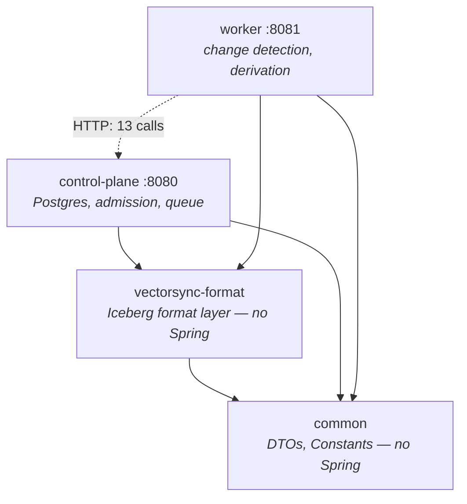
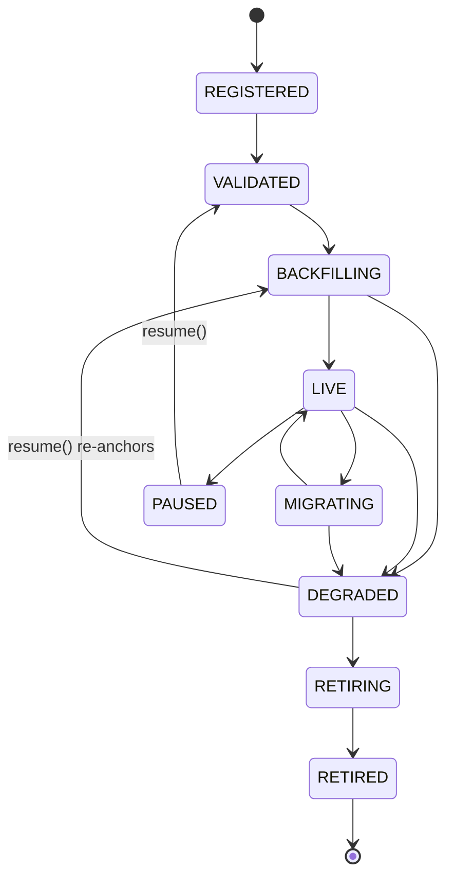
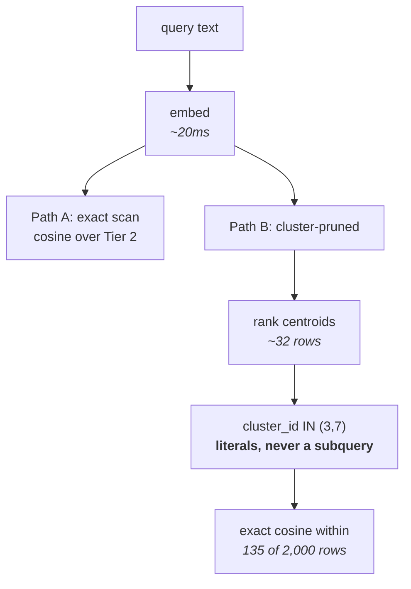

# VectorSync — Repository Graph

A structural map of the repository: modules, tables, state machine and query paths.

Module edges come from the POMs, table edges from the call sites of each table's loader.

---

## 1. Module graph

No cycles. `common` and `format` are leaves and **must not depend on Spring** — enforced by
`maven-enforcer-plugin` `bannedDependencies` in both POMs, not by convention.

Not Maven modules: `embedding-service` (Python/FastAPI, `:8000`), `dashboard` (Vite/React, `:3000`),
`bench/` (Python), `deployment/`, `scripts/`, `docs/`.

## 2. Table graph

| Table | Written by | Read by | Partitioning |
|---|---|---|---|
| `embedding_store` | `DeriveService` | `ProjectionBuilder`, `ClusterIndexService` | `identity(model_version)` |
| `content_map` | `DeriveService` | `ProjectionBuilder` | `identity(source_table, config_id)` |
| `vectors_<t>_<cfg>` | `ProjectionBuilder` | engines, `ProjectionReader` | `identity(source_table, model_version)` |
| `clustered_<t>` | `ClusterIndexService` | engines, `ClusteredIndex.probe` | `identity(model_version, config_id, cluster_id)` |
| `vector_centroids` | `ClusterIndexService` | `ClusteredIndex.probe` | `identity(model_version, config_id)` |
| `vector_index_coverage` | `ClusterIndexService` | `ClusterIndexService` | `identity(model_version, config_id)` |

`hash_prefix` is **still a column** on `embedding_store` at field id 4 and is no longer a partition
field. Removing the column would brick the table: historical specs source its field id.

## 3. Control-plane state machine

One inconsistency worth recording: `State.isSchedulable()` includes `DEGRADED`, while the worker's
`DerivationControlClient.runnable()` requests only `VALIDATED`, `BACKFILLING` and `LIVE`. The
entity's own notion of schedulable and the worker's therefore disagree. Left as-is deliberately —
widening `runnable()` would resume degraded materializations automatically, which is the opposite of
a deliberate operator action — but it is a real disagreement, not a subtlety.

## 4. Query paths

Approximation lives **entirely** in the partition predicate; scoring inside a probed partition is
exact, so a missed neighbour is explainable as "it sat in a cluster that was not probed". The
cluster ids must be literals: pruning happens at plan time, so the same query written with a
subquery read 1,699 rows instead of 135.

## 5. Known limits

- **`IncrementalChangeDetector` has no test coverage**, and it owns `assess`, `backfillWork` and
  `incrementalWork` — the classification that decides whether a snapshot range is safe to scan
  incrementally. It is the largest untested surface in the repository.
- **The reconcile sweep is whole-table.** `content_map` records
  `(source_table, source_row_id, chunk_ordinal, config_id)` and not the source partition a row came
  from, so a partition-scoped present-set cannot be compared against a whole-table live-set without
  tombstoning every row in every partition the scan skipped. The sweep therefore reads every key:
  one projected scan of the key columns, no vectors.
- **Tier-2 overwrite is scoped to `(source_table, model_version)`**, both of which are constant
  within a projection, so a rebuild replaces the whole slice rather than the changed partitions.
- **Derived-table compaction is not automatic.** Long-running deployments accumulate small files on
  `content_map` and `embedding_store`, and planning cost grows with them.
- **Authentication ships behind `vectorsync.auth.enabled`**; the dashboard proxy, `deployment/`
  scripts and `bench/` clients do not yet send a credential.
- **`State.isSchedulable()` includes `DEGRADED`** while `runnable()` does not request it, so the
  entity's notion of schedulable and the worker's disagree. Left deliberately: widening `runnable()`
  would resume degraded materializations automatically, which is the opposite of a deliberate
  operator action.
