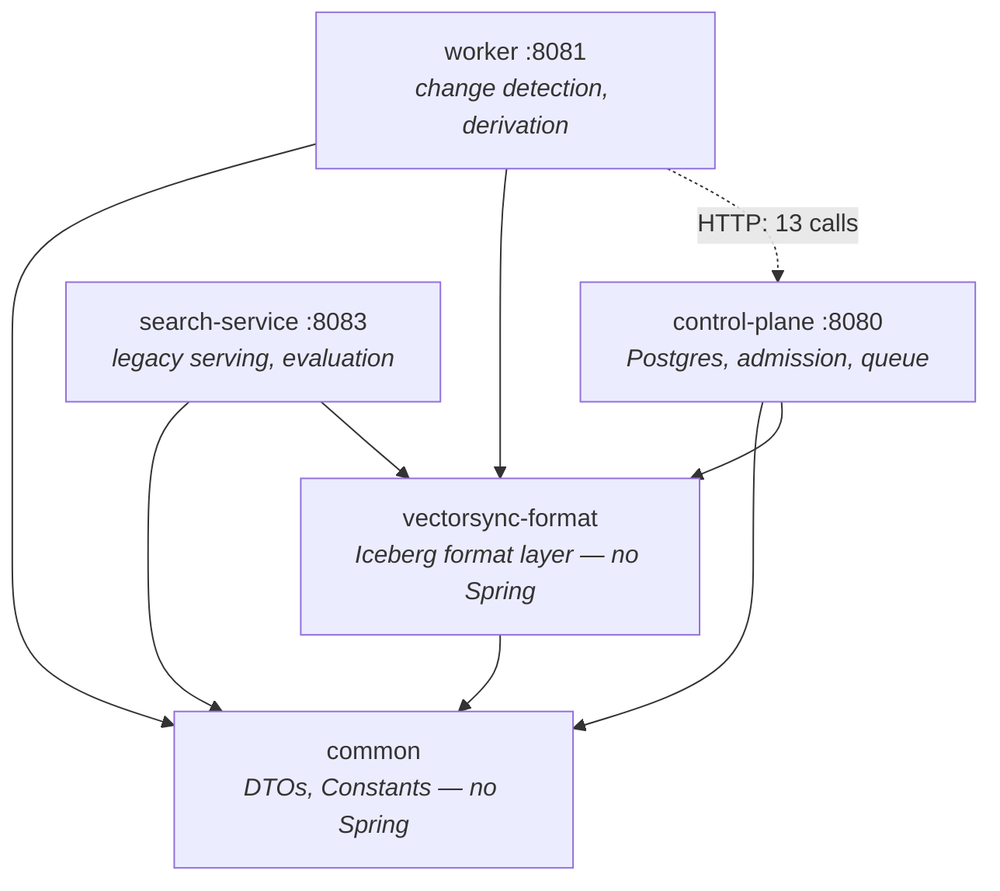
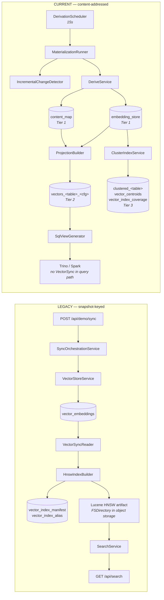
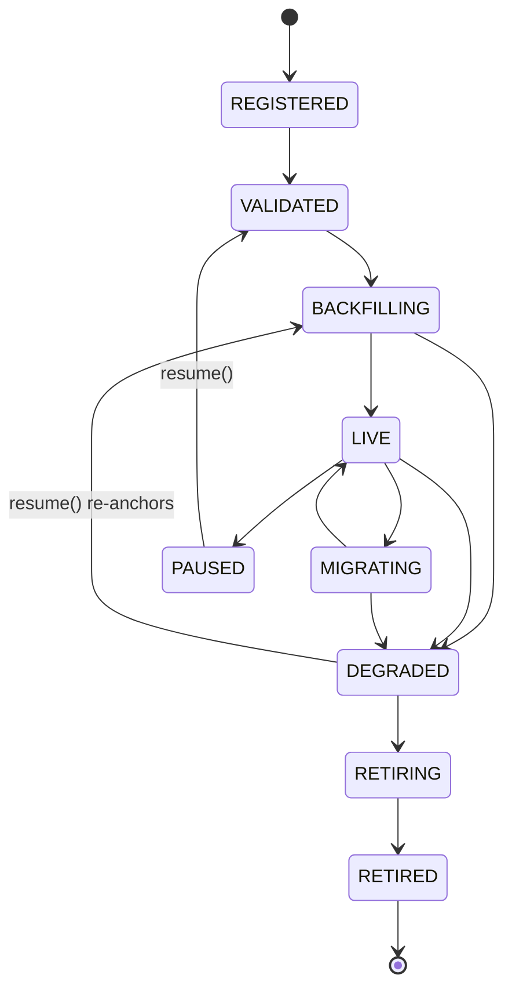
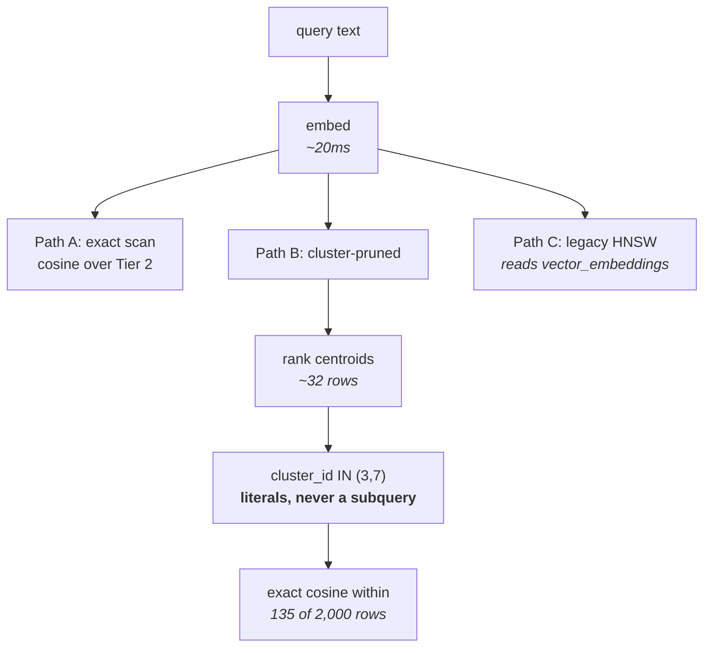

# VectorSync — Repository Graph

A structural map of what exists and how it connects, derived by inspection rather than from the
design documents. Where this disagrees with a design document, this file is the one that was
generated from the code.

Method and its limits: module edges come from the POMs; table edges from the call sites of each
table's loader; endpoint reachability from a repo-wide search including the non-Java callers under
`dashboard/`, `bench/`, `deployment/` and `docker-compose.yml`. Reachability of a Spring bean is
**not** inferable from direct references — a `@Service` or `@RestController` has no callers and is
live — so "zero references" below always states whether the type is container-managed.

---

## 1. Module graph



No cycles. `common` and `format` are leaves and **must not depend on Spring** — enforced by
`maven-enforcer-plugin` `bannedDependencies` in both POMs, not by convention.

Not Maven modules: `embedding-service` (Python/FastAPI, `:8000`), `dashboard` (Vite/React, `:3000`),
`bench/` (Python), `deployment/`, `scripts/`, `docs/`.

## 2. The two pipelines

The single most important structural fact: **there are two derivation paths, and they do not
compose.** They share the catalog and nothing else.



The legacy path is what `deployment/test-e2e-lifecycle.sh` actually proves, and `DemoController` is
registered unconditionally, so `vector_embeddings` **is** written in every deployment. The current
path has no end-to-end script.

## 3. Table graph

| Table | Written by | Read by | Partitioning |
|---|---|---|---|
| `embedding_store` | `DeriveService` | `ProjectionBuilder`, `ClusterIndexService` | `identity(model_version)` |
| `content_map` | `DeriveService` | `ProjectionBuilder` | `identity(source_table, config_id)` |
| `vectors_<t>_<cfg>` | `ProjectionBuilder` | engines, `ProjectionReader` | `identity(source_table, model_version)` |
| `clustered_<t>` | `ClusterIndexService` | engines, `ClusteredIndex.probe` | `identity(model_version, config_id, cluster_id)` |
| `vector_centroids` | `ClusterIndexService` | `ClusteredIndex.probe` | `identity(model_version, config_id)` |
| `vector_index_coverage` | `ClusterIndexService` | `ClusterIndexService` | `identity(model_version, config_id)` |
| `vector_embeddings` | **legacy** `VectorStoreService` | `VectorSyncReader` | `(source_table, model_version)` |
| `vector_index_manifest` | `IndexManifestStore` | `SearchService`, `LifecycleController` | — |
| `vector_index_alias` | `IndexAliasStore` | `IndexRegistry` | — |

`hash_prefix` is **still a column** on `embedding_store` at field id 4 and is no longer a partition
field. Removing the column would brick the table: historical specs source its field id.

## 4. Control-plane state machine



One inconsistency worth recording: `State.isSchedulable()` includes `DEGRADED`, while the worker's
`DerivationControlClient.runnable()` requests only `VALIDATED`, `BACKFILLING` and `LIVE`. The
entity's own notion of schedulable and the worker's therefore disagree. Left as-is deliberately —
widening `runnable()` would resume degraded materializations automatically, which is the opposite of
a deliberate operator action — but it is a real disagreement, not a subtlety.

## 5. Query paths



Approximation lives **entirely** in the partition predicate; scoring inside a probed partition is
exact, so a missed neighbour is explainable as "it sat in a cluster that was not probed". The
cluster ids must be literals: pruning happens at plan time, so the same query written with a
subquery read 1,699 rows instead of 135.

## 6. Dead code: what was found and what was done

Class-level orphan analysis found very little, because nearly every zero-reference type is
container-managed. Acted on:

| Finding | Evidence | Action |
|---|---|---|
| `CorsConfig` | Dashboard uses relative `/api` paths proxied same-origin by both nginx and vite; no absolute-URL call anywhere in `dashboard/src`, so no in-repo caller ever issues a preflight. With Spring Security now present, a stray `CorsFilter` is an ordering hazard rather than merely unused. | **deleted** |
| `search.use-hnsw-index`, `search.index-rebuild-threshold` | Declared in yml with env overrides, read by zero Java. `use-hnsw-index: true` is worse than unused — it advertises a toggle that does not exist. | **deleted** |
| `SEARCH_DEFAULT_LIMIT`, `SEARCH_MAX_LIMIT`, `SEARCH_MIN_SIMILARITY` | Set in `docker-compose.yml`, read nowhere. | **deleted** |
| `REACT_APP_CONTROL_PLANE_URL`, `REACT_APP_SEARCH_SERVICE_URL` | Create-React-App naming; this dashboard is Vite, which only exposes `VITE_*`. Read nowhere. | **deleted** |
| `EmbeddingEntry.hashPrefix()` | Zero callers, and its javadoc described a partition that no longer exists. | deleted earlier |
| `SqlViewGenerator` | Zero callers — the only provably dead *serving* class. | **wired, not deleted** (§7) |

Deliberately **not** deleted, with reasons, because an earlier review proposed removing ~40 files on
a false premise:

- **`search-service`** — live, not dead. `DemoController` has no `@ConditionalOnProperty`, so
  `POST /api/demo/sync` writes `vector_embeddings` in every deployment; four `deployment/` scripts
  call it; the module has 16 passing tests and a 247-line e2e script asserting on 15 of its
  endpoints. Deleting it removes the only end-to-end serving proof that exists.
- **`EvaluationService`** — sole writer of `index_recall@k`, which `LifecycleController`
  `promotionBlockers` is the sole reader of. Deleting it converts a gated, auditable promotion into
  an ungated one.
- **`hash_prefix` column** — see §3.

## 7. `SqlViewGenerator` is now reachable

It had zero callers, which meant the project's central claim — vectors are an open table queried by
your own engine, no VectorSync in the query path — was delivered only as SQL to copy out of a test.
Every benchmark and document showing a Trino query was pasting it by hand.

```
GET /api/derive/view?sourceTable=default.products&configId=<cfg>&engine=trino&qualifier=iceberg.vectorsync
```

The dimension is read from the projection rather than accepted as a parameter, because it is the one
value a caller cannot guess and must not get wrong: Trino's `cosine_similarity` returns NULL rather
than raising on a length mismatch, so a wrong width yields an all-NULL ranking that looks like a
working query returning bad results. The emitted view carries a `cardinality(...)` guard for the
same reason.

## 8. Known structural gaps

- **Two pipelines.** The legacy path is what the e2e script proves; the current path has no
  equivalent. Retiring the legacy path requires answering: is `POST /api/demo/sync` product or
  scaffolding, what replaces the e2e proof, does the `index_recall@k` gate survive, and do
  `Lifecycle.tsx` / `SemanticSearch.tsx` go or get repointed.
- **`IndexManifestEntry.partitionValue`** is declared and read, and written nowhere: every legacy
  index is whole-table. Partition-scoped ANN exists in the data model only.
- **Legacy `indexId` embeds `sourceSnapshotId`**, so one index is valid for exactly one snapshot and
  a compaction forces a full rebuild. Tier 3 does not have this defect — it is keyed by content
  coverage. The repo therefore contains one index with rewrite-invariance and one that cannot have
  it.
- **Deletes on a source table are refused**, not reconciled. `DEGRADED` is now recoverable by
  re-anchoring, but the anchor jump skips the offending range without tombstoning it.
- **Authentication ships disabled**; the dashboard proxy, `deployment/` scripts and `bench/` clients
  do not yet send a credential.
