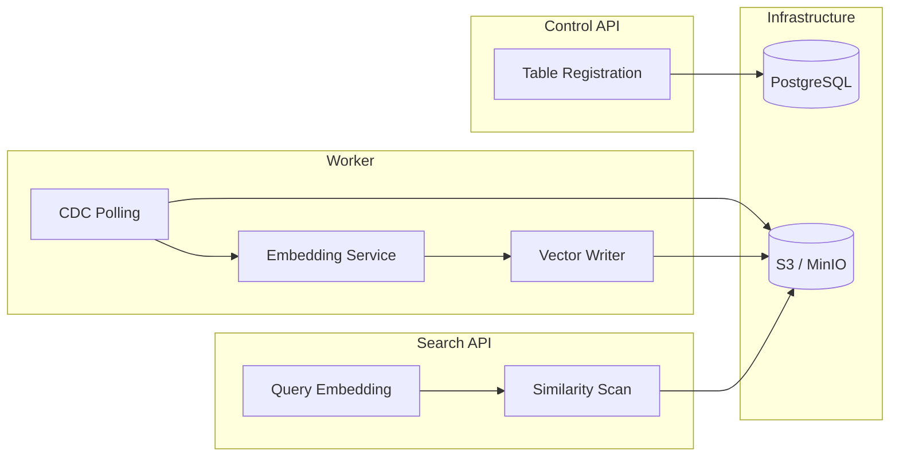

# Iceberg Vector Architecture

This document expands on the high-level flow described in the README.

## Key Flows

1. Control API registers tables and persists metadata to PostgreSQL.
2. Worker polls Iceberg snapshots, performs incremental scans, and writes embeddings to the vector table.
3. Search API reads the vector table from Iceberg and performs brute-force similarity ranking.

## Architecture Diagram (Mermaid)

## Vector Table

The vector table is an Iceberg table named `vector_embeddings` partitioned by `source_table` and `days(created_at)` to keep scans efficient and append-friendly.
